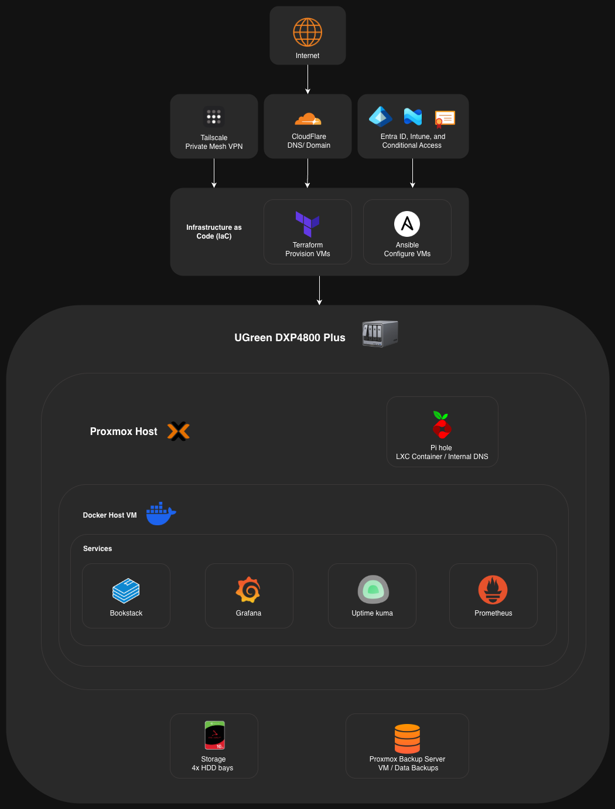
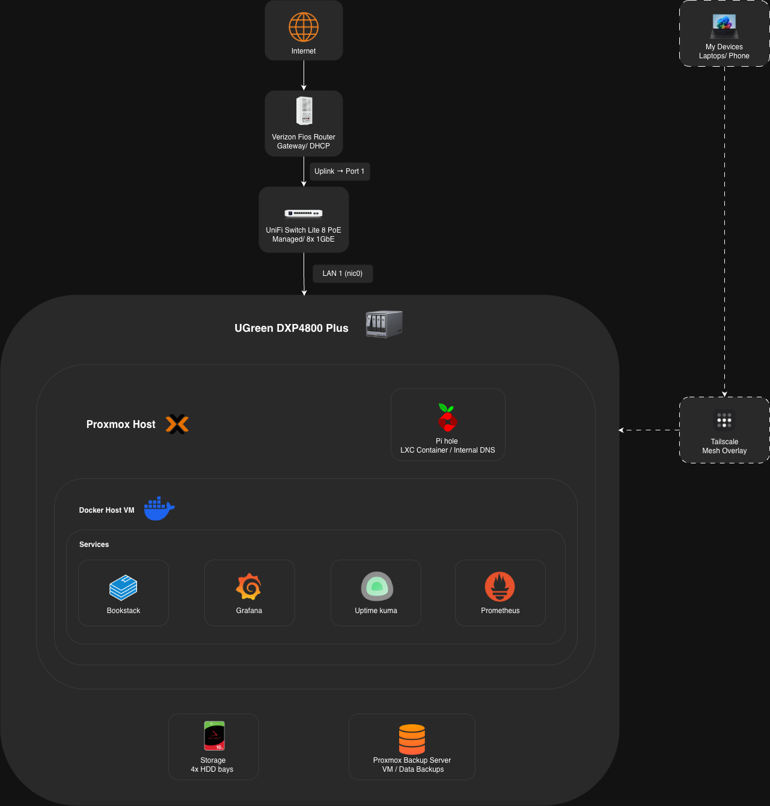

# Homelab Infrastructure

>## ⚠️ **Security Notice**
> This repository contains sanitized documentation 
> and example configurations of my homelab environment.
> - No real credentials, API keys, or secrets are included
> - All domains, IP addresses, and identifiers are 
>   redacted or replaced with placeholders
> - Configuration files are provided as examples only
>
> This project is intended to demonstrate architecture, 
> security practices, and system design, not expose 
> a live environment.

---

## Overview 
 Self-hosted infrastructure environment designed to simulate enterprise systems
 
## Hardware
- UGREEN DXP4800 Plus (Intel Pentium Gold 8505, 8GB DDR5)
- Crucial P310 500GB NVMe (hypervisor boot drive)
- 4x HDD bays (expanding for storage + redundancy)

## Stack
- Hypervisor: Proxmox VE
- Containers: Docker + K3s (lightweight Kubernetes in planning)
- Networking: Tailscale (secure remote access)
- Monitoring: Grafana + Uptime Kuma
- Media Server: Jellyfin
- Web Access: Nginx Proxy Manager (reverse proxy + SSL)
- DNS: Pi-hole (internal DNS) & Cloudflare (external DNS + domain)

## Architecture

> Diagrams are redacted to remove sensitive 
> network details. See docs/architecture/ for 
> full documentation.
> 

## Services
| Service | Purpose | Status |
|---------|---------|--------|
| Proxmox VE | Hypervisor | Planned |
| Tailscale | Zero trust vpn | Planned |
| Jellyfin | Media server | Planned |
| Nginx Proxy Manager | Reverse proxy + SSL | Planned |
| Pi-hole | Internal DNS + Ad blocking | Planned |
| Cloudflare | External DNS + Domain | Planned |
| Kubernetes: K3s | Container orchestration | Planned |
| Grafana | Monitoring dashboard | Planned |
| Uptime Kuma | Service uptime monitoring | Planned |

## Security Approach
| Layer | Implementation |
|-------|---------------|
| Network | Tailscale zero trust mesh |
| Proxy | Nginx Proxy Manager access lists |
| Application | Per service authentication |
| Secrets | .env files, never committed |
| DNS | Pi-hole internal, Cloudflare external |

See [docs/security/](docs/security/) for full details.

---

  ## Case Studies
| Study | Description |
|-------|-------------|
| [Proxmox Setup](docs/case-studies/proxmox-setup.md) | Hypervisor install + VM architecture |
| [Tailscale Access](docs/case-studies/tailscale-access.md) | Zero trust remote access implementation |
| [Reverse Proxy](docs/case-studies/reverse-proxy.md) | Nginx Proxy Manager + SSL setup |
| [DNS Architecture](docs/case-studies/dns.md) | Pi-hole + Cloudflare split DNS |
| [Monitoring Stack](docs/case-studies/monitoring.md) | Grafana + Uptime Kuma deployment |
| [Jellyfin](docs/case-studies/jellyfin.md) | Media server behind reverse proxy |
| [Authentication](docs/case-studies/authentication.md) | Multi layer auth implementation |
| [Automation](docs/case-studies/automation.md) | Alerting and script automation |
| [Backups](docs/case-studies/backups.md) | Proxmox Backup Server setup |
  
