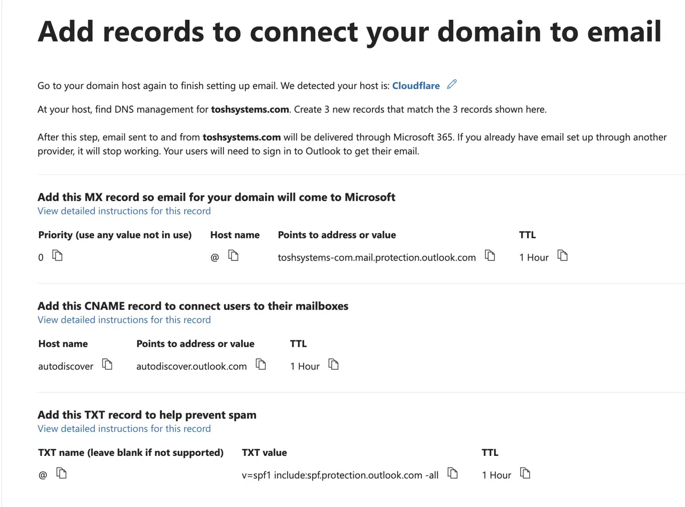

# Case Study: Integrating toshsystems.com with Microsoft 365

Status: Completed

## Summary

The lab domain was already managed through Cloudflare, while Microsoft 365 was still using the tenant's default `toshsystems.onmicrosoft.com` namespace. This project connected the existing domain to Microsoft 365 without moving DNS management away from Cloudflare. The work included verifying ownership of the domain, changing the primary administrator's UPN, configuring Exchange Online mail routing, and publishing the DNS records needed for SPF, autodiscover, DKIM, and DMARC.

A DKIM validation issue also required checking the published records independently. Microsoft reported that the required CNAMEs could not be found even though both records were already resolving correctly from public DNS.

Two parts of the setup also required troubleshooting outside the Microsoft 365 portals. Microsoft initially reported that the DKIM records could not be found even though both CNAMEs were already resolving publicly, and Gmail later showed DMARC as failing shortly after the policy was published. In both cases, direct DNS queries confirmed that the records were correct, so I left the configuration alone and allowed the external validation systems to catch up.

By the end of the project, toshsystems.com was fully connected to Microsoft 365 and SPF, DKIM, and DMARC were all passing when tested through Gmail.

## Purpose

The goal was to use `toshsystems.com` as the primary domain for the Microsoft 365 environment while keeping Cloudflare as the authoritative DNS provider.
By using the custom domain it gives the tenant a more realistic identity and mail configuration than relying on the default onmicrosoft.com namespace. It also created an opportunity to configure the same DNS records that support Exchange Online in a business environment.

The finished setup needed to provide:
-Microsoft 365 sign-ins using the custom domain
-email addresses ending in @toshsystems.com
-inbound mail delivery through Exchange Online
-SPF authorization for outbound mail
-DKIM signing
-a DMARC enforcement policy and reporting address
-Outlook autodiscovery
-an emergency administrator that does not depend on the custom domain

As a result, Cloudflare remained responsible for the DNS zone throughout the project, so the Microsoft 365 records were added manually instead of giving Microsoft control over the zone.

## Design Decision

| Tool/Function              | Decision                           | Alternative               | Reason                                                                                                                                                     |
| -------------------------- | ---------------------------------- | ------------------------- | -----------------------------------------------------------------------------------|
| DNS management             | Manual configuration in Cloudflare | Microsoft Domain Connect  | Kept DNS changes under direct control and avoided giving Microsoft permission to modify the Cloudflare zone                                                |
| SPF policy                 | `-all`                             | `~all`                    | Exchange Online is currently the only authorized sender for `toshsystems.com`, so mail from sources outside the published SPF policy should fail the check |
| DMARC policy               | `p=quarantine`                     | `p=none` or `p=reject`    | Quarantine provides enforcement while leaving room to review DMARC reports before moving to a stricter reject policy                                       |
| Break-glass account        | Remain on `onmicrosoft.com`        | Move to `toshsystems.com` | Keeps emergency access independent of the custom domain if DNS or domain configuration causes a sign-in problem                                            |
| Mail-related CNAME records | Cloudflare DNS only                | Cloudflare proxy          | Microsoft service records need to resolve directly to Microsoft endpoints rather than passing through the Cloudflare proxy                                 |

## Implementation

### Domain Verification

Microsoft generated a TXT record containing a unique ownership value, such as MS=msXXXXXXXX, which was added at the root of toshsystems.com in Cloudflare. Within several minutes, Microsoft detected the record and verified the domain. The TXT record is only used to prove control of the DNS zone and does not participate in normal Exchange Online mail flow after verification.

### Administrator Identity

After the domain was verified, the primary administrator was changed from michael.mcintosh@toshsystems.onmicrosoft.com to michael.mcintosh@toshsystems.com. This updated the account's user principal name rather than creating a new identity, so the existing password, MFA registration, administrative roles, and account identity remained unchanged. The break-glass administrator was intentionally left on the original onmicrosoft.com namespace.

### Exchange Online DNS

The Exchange Online records were entered manually in Cloudflare.

| Record | Name           | Value                                            | Function                                                   |
| ------ | -------------- | ------------------------------------------------ | ---------------------------------------------------------- |
| MX     | `@`            | `toshsystems-com.mail.protection.outlook.com`    | Routes inbound mail to Exchange Online                     |
| TXT    | `@`            | `v=spf1 include:spf.protection.outlook.com -all` | Authorizes Exchange Online to send mail for the domain     |
| CNAME  | `autodiscover` | `autodiscover.outlook.com`                       | Allows supported clients to locate Microsoft mail settings |

The MX record uses priority 0, while SPF terminates with -all because Exchange Online is currently the only authorized sender for the domain. The autodiscover record was also created as DNS only in Cloudflare rather than being proxied.

DKIM

DKIM configuration was started through Microsoft Defender, which generated the two selectors selector1._domainkey and selector2._domainkey. Each selector was added to Cloudflare as a DNS-only CNAME. Microsoft uses two selectors so DKIM signing keys can be rotated without interrupting verification. The generated targets used Microsoft's newer DKIM namespace containing q-v1.dkim.mail.microsoft rather than the older onmicrosoft.com target format shown in many earlier setup examples.

### Challenges & Troubleshooting

After both DKIM CNAME records were published, Microsoft continued to report that the records could not be found. Instead of deleting or recreating them, public DNS was checked directly with:

`dig selector1._domainkey.toshsystems.com CNAME +short`
`dig selector2._domainkey.toshsystems.com CNAME +short`

Both queries returned the expected Microsoft destinations, confirming that the selectors existed, were publicly resolvable, were not being proxied, and were pointing to the correct CNAME targets. Since the DNS configuration was already correct, the issue was isolated to a mismatch between what public DNS was returning and what Microsoft's DKIM validator was recognizing. The Cloudflare records were therefore left unchanged, with the remaining step being to retry DKIM activation after Microsoft's validation process catches up.

### Outcome

toshsystems.com is now fully connected to the Microsoft 365 tenant while Cloudflare remains responsible for DNS.

The primary administrator uses michael.mcintosh@toshsystems.com, while the emergency administrator remains on the tenant's native onmicrosoft.com namespace. Exchange Online is handling inbound mail, and test messages were delivered in under five seconds.

The finished mail configuration includes:

-an MX record with priority 0 routing mail to Exchange Online
-SPF using a hard-fail -all policy
-Outlook autodiscover
-two published DKIM selectors
-DKIM signing enabled and showing as Valid in Microsoft Defender
-DMARC using p=quarantine
-aggregate DMARC reporting sent to the administrator mailbox

After sending three test emails through Gmail, I confirmed that SPF, DKIM, and DMARC all pass when evaluated by an external receiving system.

## Skills Demonstrated

This project gave me hands-on experience connecting a custom domain to Microsoft 365 while keeping DNS hosted with a separate provider. The work involved Cloudflare DNS administration, Microsoft 365 domain verification, Entra ID UPN changes, Exchange Online mail routing, and the configuration of SPF, DKIM, DMARC, and autodiscover.

The troubleshooting portion was just as important as publishing the records. I used dig to check DNS independently of the Microsoft and Gmail interfaces, which made it possible to tell the difference between an incorrect DNS record and a validation or caching delay.

Other areas covered during the project included break-glass account planning, DNS-only CNAME configuration, email authentication testing, and working across Cloudflare, Microsoft 365, Microsoft Defender, Exchange Online, and Gmail.

## Enterprise Relevance

Connecting a custom domain is a normal part of deploying or expanding Microsoft 365 in a business environment. Organizations may need to add Microsoft 365 to an existing DNS zone, introduce an additional domain, or change how an existing domain is used for authentication and email. Additionally, the same record types configured here are used in production environments. MX controls where inbound mail is delivered, SPF identifies approved sending systems, DKIM provides a cryptographic signature for outbound messages, DMARC adds policy and reporting on top of SPF and DKIM, and autodiscover helps supported clients locate Exchange Online services.

The administrator setup is also relevant because an emergency account on the Microsoft-provided onmicrosoft.com namespace gives administrators another path into the tenant if the organization's custom domain becomes unavailable or is configured incorrectly.

The DKIM and DMARC issues were also representative of the type of problem that can occur when several platforms are involved in the same change. Cloudflare, Microsoft, and Gmail did not all report the new DNS state at exactly the same time. Querying public DNS directly made it possible to confirm which side was actually working and avoid changing records that were already configured correctly.
